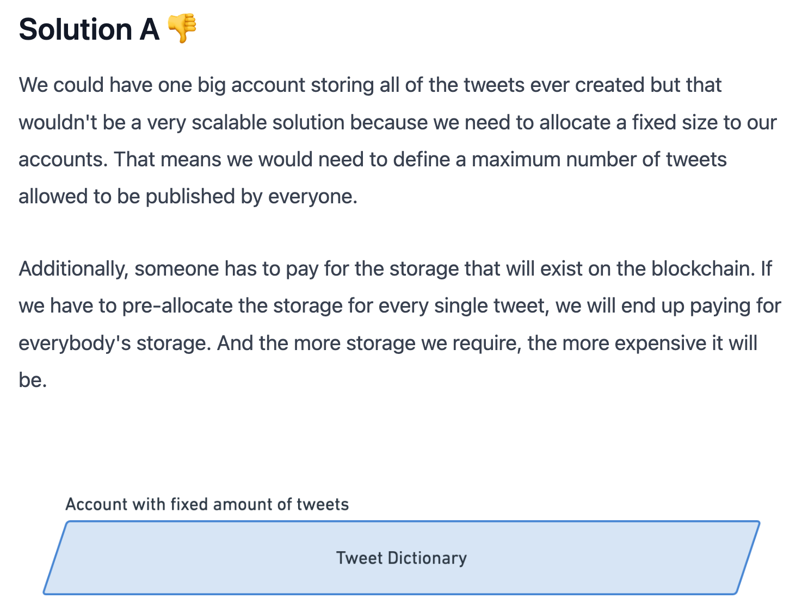
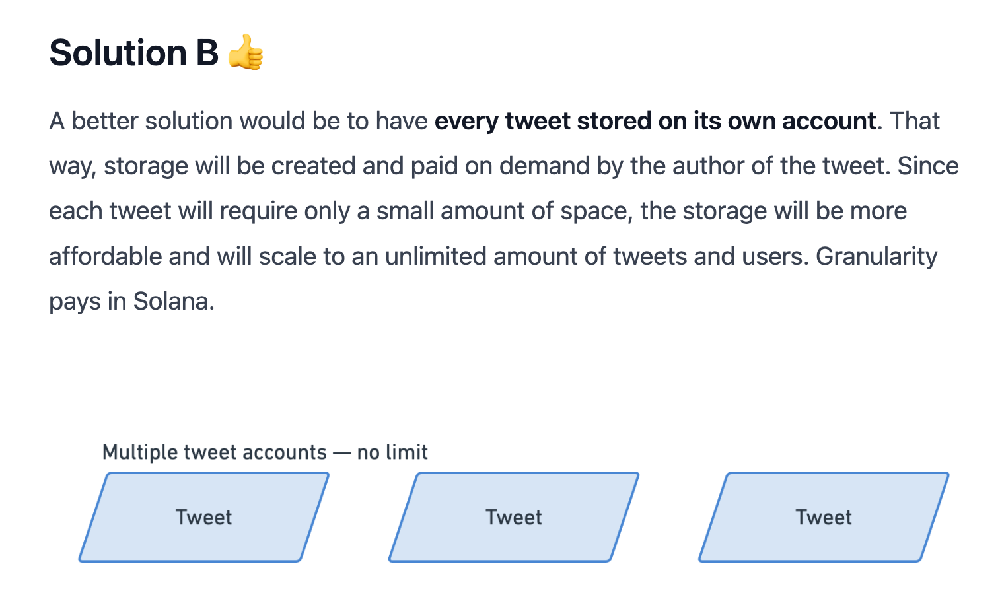
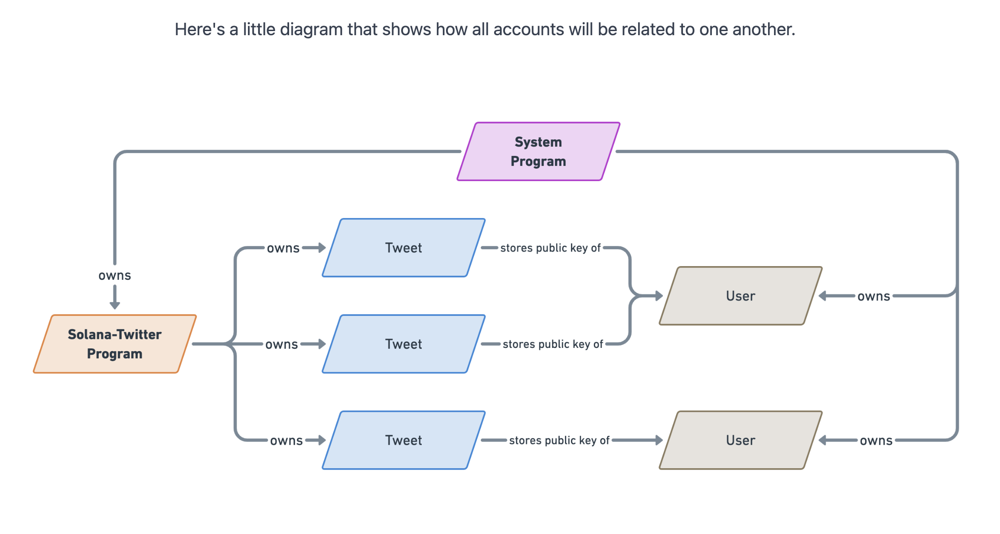
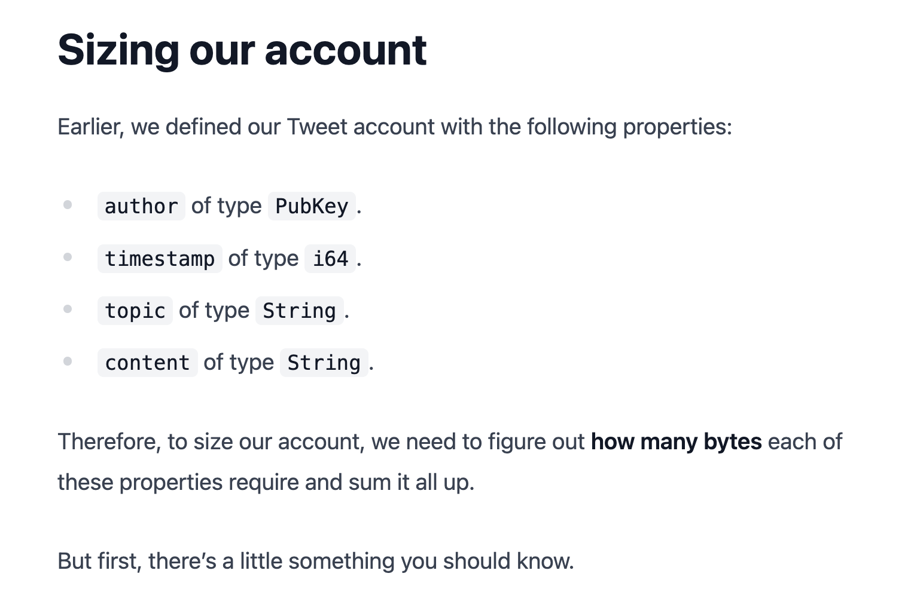
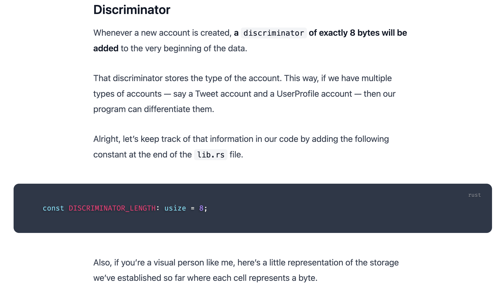
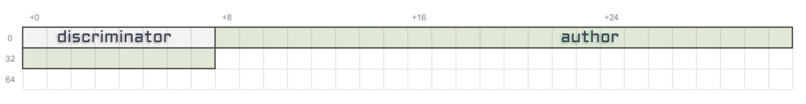
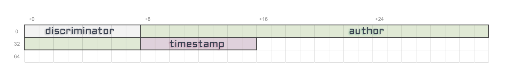
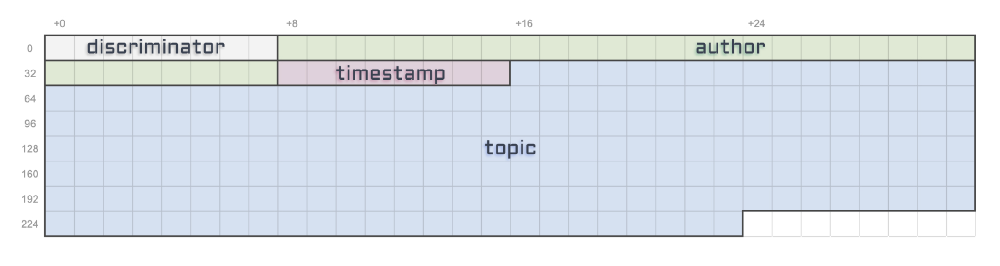
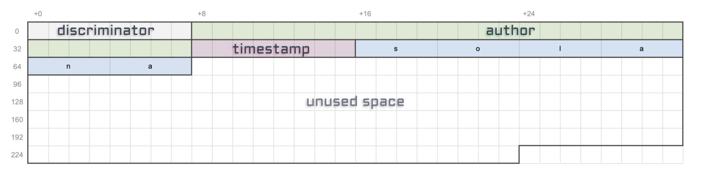

# Twitter SC on Solana

Build twitter based contracts for Solana blockchain

## Overview

- Anyone connected with Phantom wallet can create a tweet with a post message & tag.

## Architecture

[SOURCE](docs/Structuring%20our%20Tweet%20account%20_%20Create%20a%20Solana%20dApp%20from%20scratch%20_%20Loris.pdf)

In Solana, everything is an account.

---

2 possible storage solutions:





---


---



---






- `author`: 32 bytes as `Pubkey` is defined like `[u8; 32]` i.e. 32 bytes.
  
- `timestamp`: 8 bytes as `u64` is defined like `u64` i.e. 8 bytes.
  
- `topic`: `String` is defined like `Vec<u8>` i.e. 1 byte with no vector size defined.
  
  So let’s make a decision that a `topic` will have a maximum size of **50 characters**. That should be enough for most topics out there.
  As per UTF-8 encoding, each character can use from 1-4 bytes. So, if max. taken - `50 * 4 = 200` bytes.

  

  It’s important to note that this size is purely indicative since vectors don’t have limits. So whilst we’re allocating for 200 bytes, typing “solana” as a topic will only require `6 x 4 = 24 bytes`.

## Init

```sh
anchor init solana-twitter
```

## Build

```sh
anchor build
```

## Deploy

```sh
anchor deploy
```

## Test

```sh
anchor test
```

## References

- [Create a Solana dApp from scratch](https://lorisleiva.com/create-a-solana-dapp-from-scratch)
