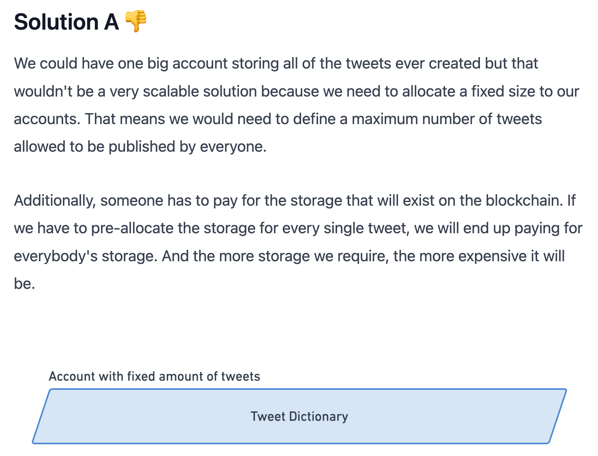
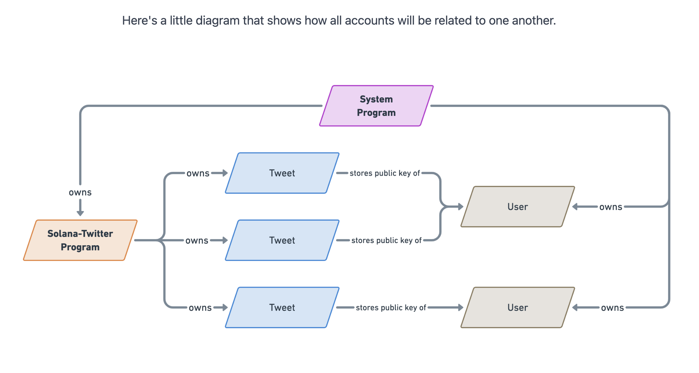
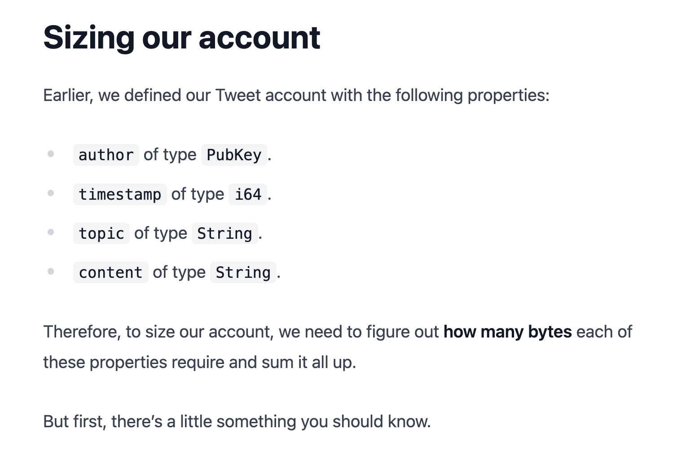
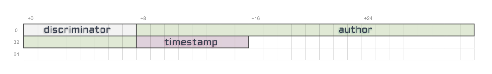
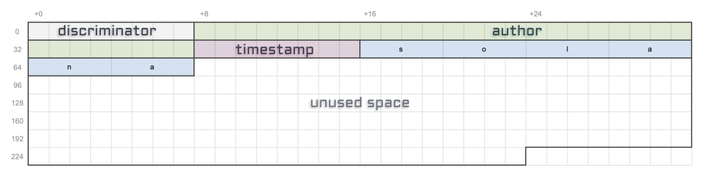

# Account Structure & Sizing

[SOURCE](./1_Structuring%20our%20Tweet%20account%20_%20Create%20a%20Solana%20dApp%20from%20scratch%20_%20Loris.pdf)

## Notes

In Solana, **everything is an account**.

---

2 possible storage solutions:




---


---



---




- `author`: 32 bytes as `Pubkey` is defined like `[u8; 32]` i.e. 32 bytes.
  

  ```rs
  const PUBLIC_KEY_LENGTH: usize = 32;
  ```

- `timestamp`: 8 bytes as `u64` is defined like `u64` i.e. 8 bytes.
  

  ```rs
  const TIMESTAMP_LENGTH: usize = 8;
  ```

- `topic`: `String` is defined like `Vec<u8>` i.e. 1 byte with no vector size defined.
  
  So let’s make a decision that a `topic` will have a maximum size of **50 characters**. That should be enough for most topics out there.
  As per UTF-8 encoding, each character can use from 1-4 bytes. So, if max. taken - `50 * 4 = 200` bytes.

  

  It’s important to note that this size is purely indicative since vectors don’t have limits. So whilst we’re allocating for 200 bytes, typing “solana” as a topic will only require `6 x 4 = 24 bytes`.

  > Before storing the actual content of our string, there will be a **4 bytes** prefix whose entire purpose is to store its total length. Not the maximum length that it could be, but the actual length of the string based on its content.

  

  That prefix is important to know where the next property is located on the array of bytes. Since vectors have no limits, without that prefix we wouldn’t know where it stops.

  

  ```rs
  const STRING_LENGTH_PREFIX: usize = 4; // Stores the size of the string.
  const MAX_TOPIC_LENGTH: usize = 50 * 4; // 50 chars max.
  ```

  i.e. `4 + 50 * 4 = 208` bytes.

- `content`: `String` is defined like `Vec<u8>` i.e. 1 byte with no vector size defined. Similarly, let's make The only thing that differs from the topic property is the character count. Here, we want the content of our tweets to be a maximum of **280** characters (each ch: 1-4 bytes) which make the total size of our content `4 + 280 * 4 = 1124` bytes.

  ```rs
  const STRING_LENGTH_PREFIX: usize = 4; // Stores the size of the string i.e. 4 bytes.
  const MAX_CONTENT_LENGTH: usize = 50 * 4; // 50 chars max. i.e. 200 bytes. max.
  ```

In this `impl` block, we define a `LEN` constant that simply sums up all the previous constants of this episode. That way we can access the length of the Tweet account in bytes by running `Tweet::LEN`.
